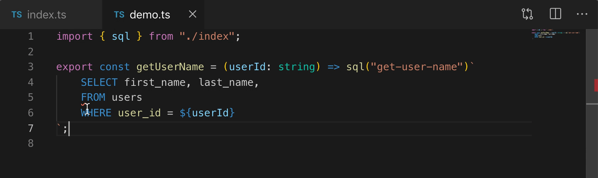

# TypeScript SQL tagged template plugin

TypeScript server plugin that adds type checking for SQL queries tagged with an `sql` function.



**Features**

- Syntax errors for SQL statements
- Type checking for expressions in SQL statements
- Formatting of SQL statements (using [pgFormatter](https://github.com/darold/pgFormatter), requires Perl)

**Limitations**

- Currently only supports PostgreSQL

## Usage

This plugin provides SQL syntax errors and type checking in TypeScript files within any editor that uses TypeScript to power their language features. This includes [VS Code](https://code.visualstudio.com) and any other editor using supporting TypeScript language server plugins.

### With VS Code

The simplest way to use this plugin is through the [SQL tagged template literals](https://marketplace.visualstudio.com/items?itemName=frigus02.vscode-sql-tagged-template-literals) extension. This extension automatically enables the plugin, and also adds syntax highlighting for SQL template strings and synchronization of settings between VS Code and the plugin.

### Other editors

First install the plugin in your project:

```bash
npm install --save-dev typescript-sql-tagged-template-plugin
```

Then add a `plugins` section to your [`tsconfig.json`](http://www.typescriptlang.org/docs/handbook/tsconfig-json.html).

```json
{
	"compilerOptions": {
		"plugins": [
			{
				"name": "typescript-sql-tagged-template-plugin"
			}
		]
	}
}
```

Then restart the TS language server.

Note for VS Code users: If you're using this way of installing the plugin for VS Code, be aware of the following gotcha. By default VS Code starts two TypeScript servers, one for semantics and one for syntax. The syntax server does not load plugins installed this way. Since formatting is done with the syntax server, it won't work unless you disable the "TypeScript > Tsserver: Use Separate Syntax Server" setting.

## Configuration

If you are using the [SQL tagged template literals](https://marketplace.visualstudio.com/items?itemName=frigus02.vscode-sql-tagged-template-literals) extension for VS Code, you can configure these settings in the editor settings.

Otherwise you can configure the behavior of this plugin in the `plugins` section of in your `tsconfig`. The following options are available:

```json
{
	"compilerOptions": {
		"plugins": [
			{
				"name": "typescript-sql-tagged-template-plugin",
				"enableDiagnostics": true,
				"enableFormat": true,
				"schemaFile": "./path/to/database-schema.json",
				"defaultSchemaName": "public",
				"pgFormatterConfigFile": "./path/to/pg_format.conf"
			}
		]
	}
}
```

- `enableDiagnostics`: Diagnostics include parsing of the SQL statements and type checking if a schema file is configured. It's enabled by default.
- `enableFormat`: Formatting is done using [pgFormatter](https://github.com/darold/pgFormatter) and requires Perl. If Perl is available, formatting is enabled by default.
- `schemaFile`: In order to do type checking for parameters in SQL statements, the plugin needs to know about your database schema. You can generate a JSON file with your DB schema using the script [scripts/schema/index.js](./scripts/schema/index.js). If you have a different DB type conversion, modify the file afterwards. Then use this setting to specify the path to the file. If the path is relative, it's resolved relative to the tsconfig.json.
- `defaultSchemaName`: For queries not specifying any schema name (e.g. `SELECT * FROM users` instead of `SELECT * FROM myschema.users`), the plugin uses this as the default schema. The value defaults to `public`, which is the Postgres default.
- `pgFormatterConfigFile`: You can customize the formatting by referencing a pgFormatter config file. See [pg_format.config.sample](https://github.com/darold/pgFormatter/blob/v4.4/doc/pg_format.conf.sample) for available options. If the path is relative, it's resolved relative to the tsconfig.json.
